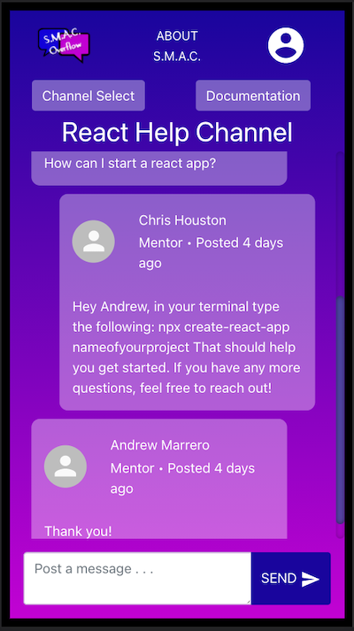

# S.M.A.C. Overflow

## Slack Messenger/Stack Overflow Inspired Collaboration App

Check out the project video demo @ https://www.youtube.com/watch?v=nceggCH1oqc
Check out the live site @ http://smac-overflow.netlify.app 

## Overview
A chat app that allows Software Developers of all experience levels to come together in a simple to use platform and share their questions and solutions in channels that are based created for specific languages.

#

## Register
Create an account and choose to be a mentor or mentee to denote experience level.

#

## Select A Channel
Select a channel and share your questions or solutions with the group in real time.

#
## Collaborate With Other Devs

Our goal is to bring together the great community that encompasses all things regarding software development, pushing the idea that we are all in this together, all for one and one for all!
#
## All-In-One Reference Point

Still a bit confused?  Pull up the documentation for whatever language or tech is giving you trouble.

#
## Mobile Responsive

S.M.A.C. Overflow Home Mobile

 
 
S.M.A.C. Overflow Register Mobile

 
 
S.M.A.C. Overflow Landing Mobile

 
 
S.M.A.C. Overflow Channels Mobile

 
 
S.M.A.C. Overflow React Channels Mobile

 
 
S.M.A.C. Overflow Docs Mobile

 
 

#
## Languages & Tech
<pre>
React 
Redux
Firebase
React-Bootstrap
JavaScript 
HTML
CSS
MUI
npm
VSCode
</pre>
